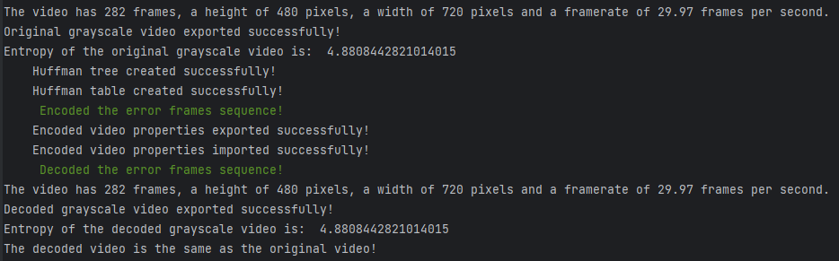
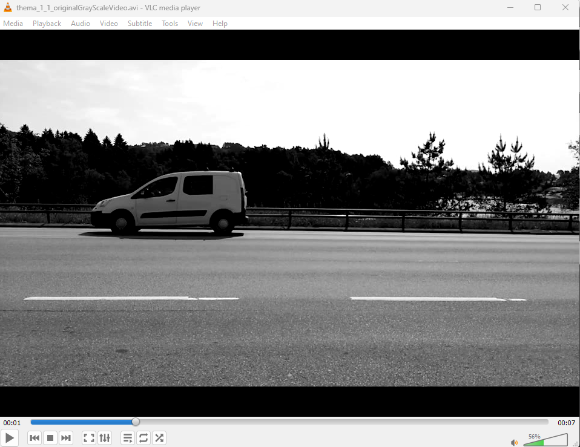
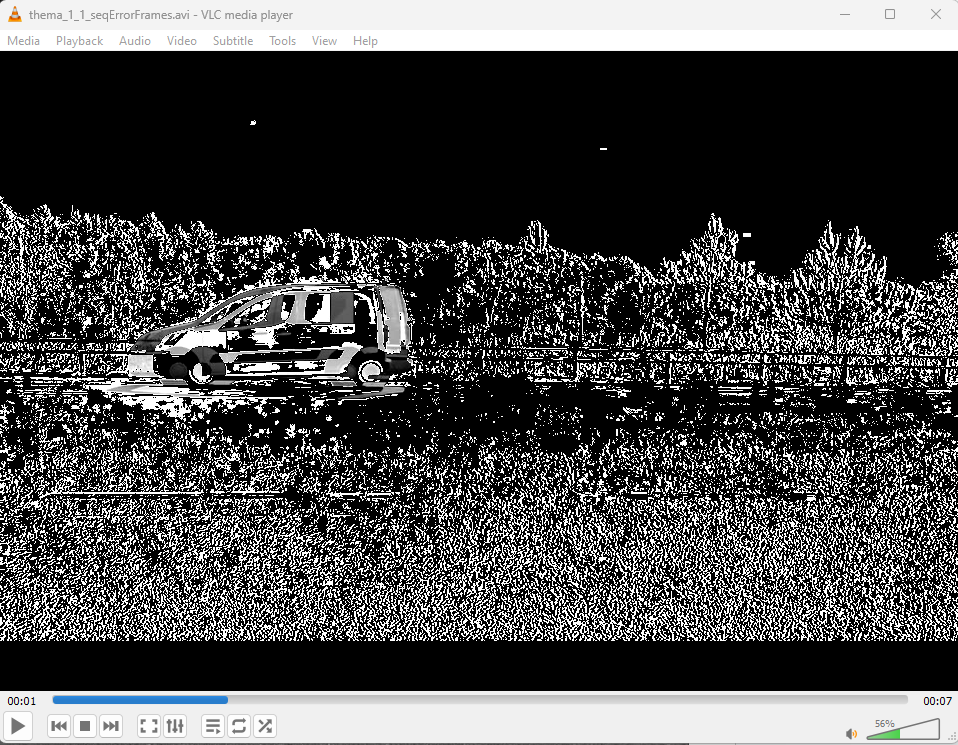
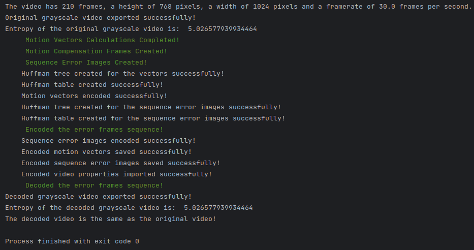
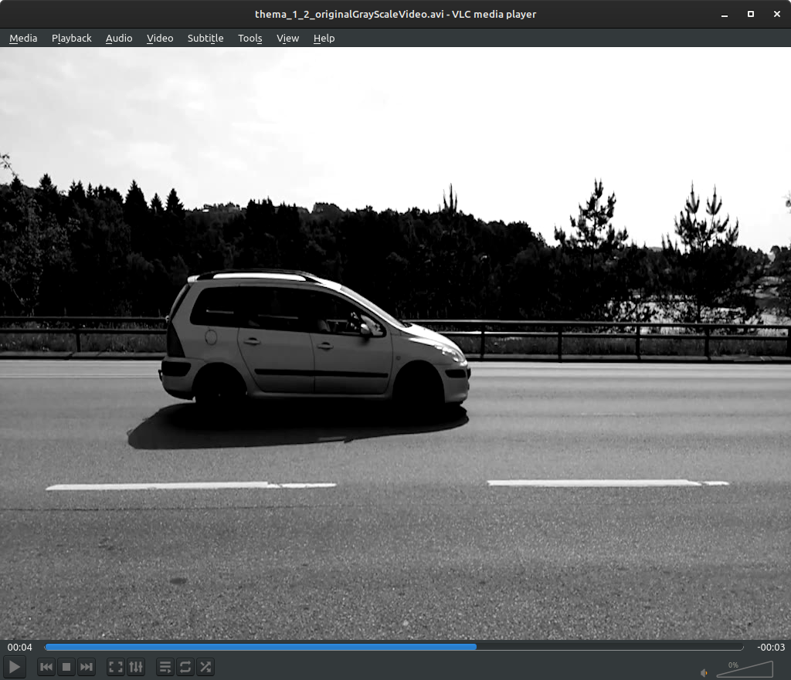
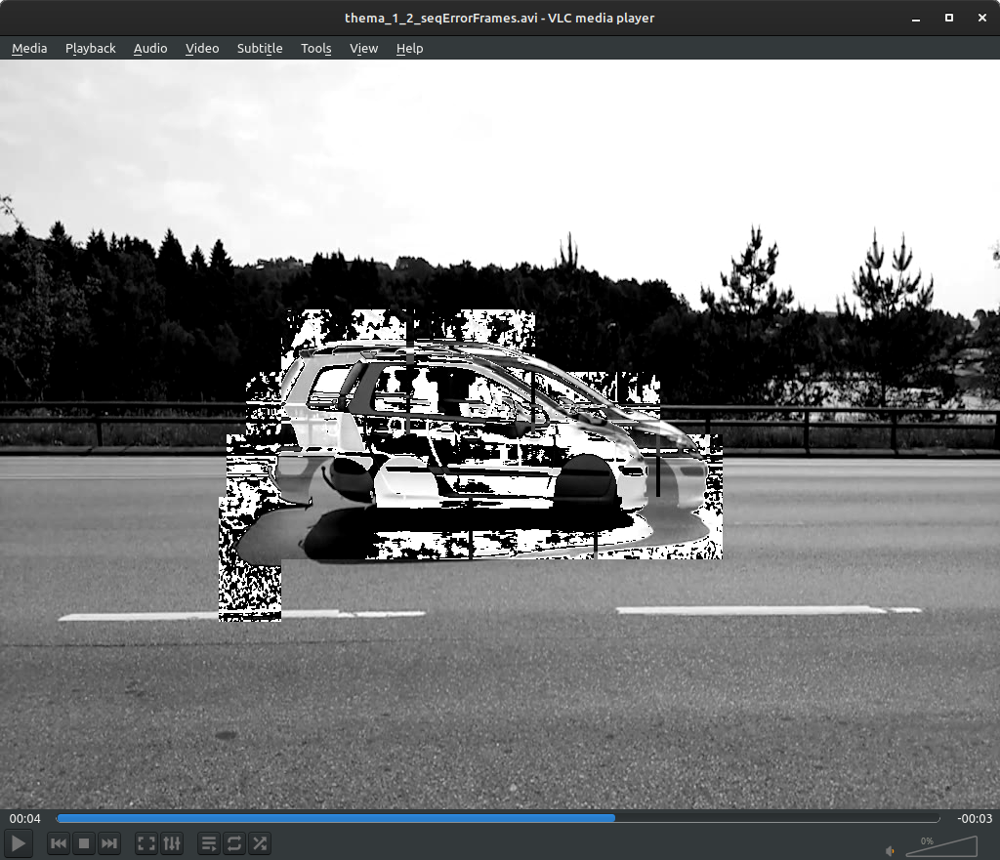
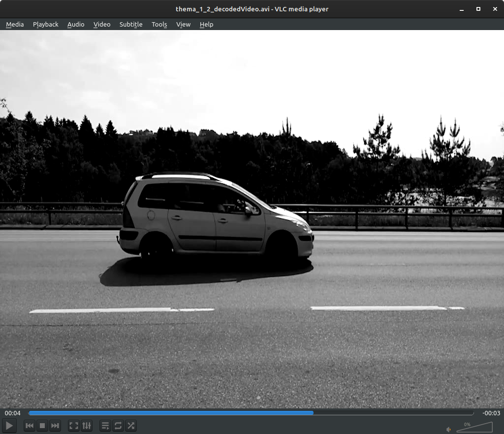
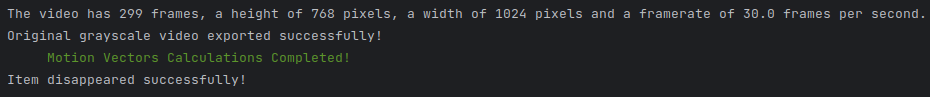
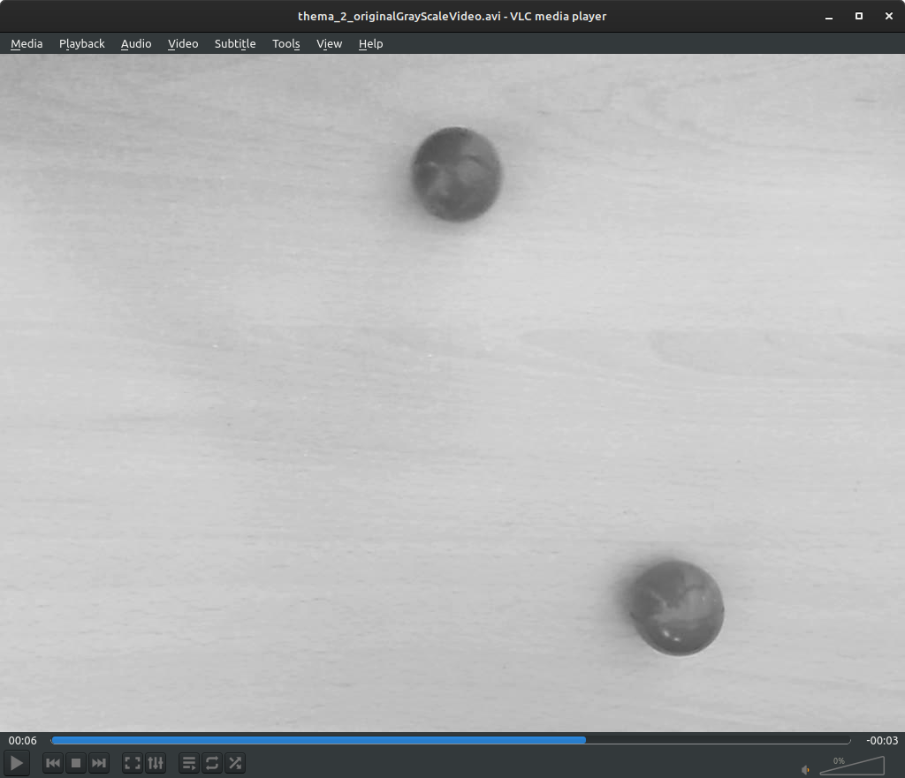
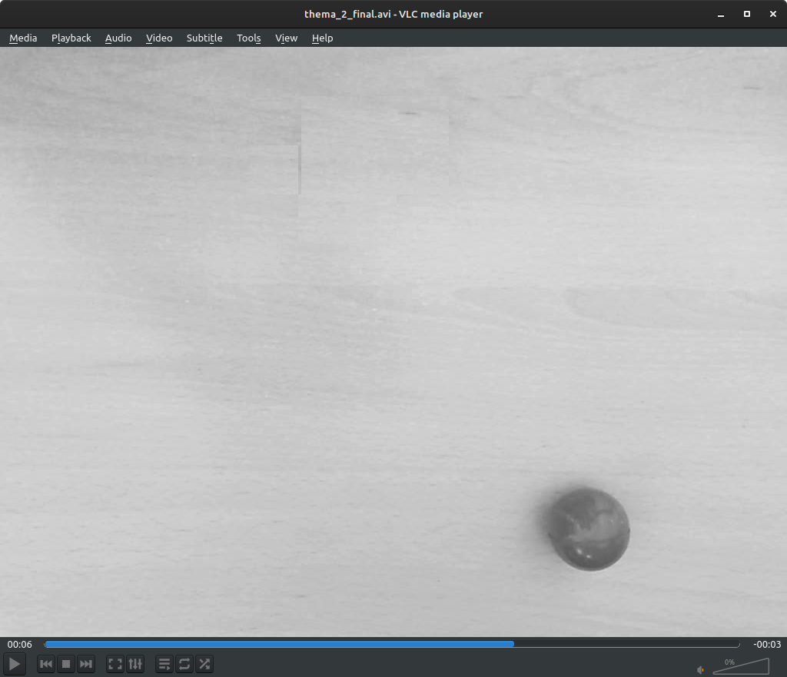

# Multimedia Systems (2023) - Compression and Object Removal

## Project Overview

This project is a team assignment for the "Multimedia Systems" course, offered in the 6th semester of the 2023 academic year at the University of Piraeus, Department of Informatics. This project focuses on video compression and object removal techniques using motion compensation. It is divided into two main tasks:

1. **Lossless Compression of Video Frames**: Implement a lossless video compression algorithm based on error images and Huffman encoding. The task involves calculating and encoding the sequence of error images from a video where the first frame is an I-frame and the subsequent frames are P-frames. Motion compensation is not applied for the initial part of this task.

2. **Motion Compensation for Video Compression**: Implement motion compensation for video compression using macroblocks and hierarchical search techniques. This task involves computing motion vectors, encoding them, and using them to predict frames. The final objective is to visualize the sequence of prediction and error images, and reconstruct the video using the encoded data.

3. **Object Removal from Video**: Utilize motion compensation to algorithmically remove an object from a video. The process involves identifying and removing the selected object from the video sequence by predicting frames without the object.

## Course Information

- **Institution:** [University of Piraeus](https://www.unipi.gr/en/)
- **Department:** [Department of Informatics](https://cs.unipi.gr/en/)
- **Course:** Multimedia Systems (2023)
- **Semester:** 6th

## Technologies Used

- Python
- **Libraries**: 
  - `opencv-python`
  - `numpy`
  - `heapq`
  - `colorama` 
  - `scipy`
  - `pickle`

## Project Structure

The repository is structured as follows:

```
/source2023
    /thema_1.1.py         # Encoder and decoder for lossless compression
    /thema_1.2.py         # Encoder and decoder for motion compensation
    /thema_2.py           # Object removal implementation
/auxiliary2023
    /OriginalVideos       # Directory containing the input videos
    /OutputVideos         # Directory containing output videos
    /VideoProperties      
/docs
    /Project-description.pdf
    /Project-documentation.pdf
```

- **`/source2023`**: Contains the source code files for the project.
- **`/auxiliary2023`**: Directory for storing the videos.
- **`/docs`**: Contains the project's pdfs.

## Usage Examples

### Lossless Compression

To encode and decode video frames without loss, run:

```bash
python source2023/thema_1.1.py
```



This script will process the input video, compute the error images, and encode them using Huffman coding.

- Original image from the input video:
  
- Error image from the input video:
  
- Final image from the output video:
  

### Motion Compensation

To compress video frames using motion compensation and hierarchical search, execute:

```bash
python source2023/thema_1.2.py
```


This script will compute motion vectors, encode them, and reconstruct the video based on motion compensation.

- Original image from the input video:
  
- Error image from the input video:
  
- Final image from the output video:
  

### Object Removal

To remove an object from a video, run:

```bash
python source2023/thema_2.py
```



This script will remove the specified object from the video and save the resulting video.

- Original image from the input video:
  
- Final image from the output video:
  

## Setup Instructions

1. **Clone the repository**

2. **Prepare input videos**:

    Place your video files in the `/auxiliary2023/OriginalVideos` directory or modify the script to point to your video file location.

4. **Run the scripts**:

    Follow the usage examples to execute the scripts.

## Contributors

<table>
  <tr>
    <td align="center"><a href="https://github.com/thkox"><br /><sub><b>Theodoros Koxanoglou</b></sub></a><br /></td>
    <td align="center"><a href="https://github.com/ApostolisSiampanis"><br /><sub><b>Apostolis Siampanis</b></sub></a><br /></td>
    <td align="center"><a href="https://github.com/dimitrisstyl7"><br /><sub><b>Dimitris Stylianou</b></sub></a><br /></td>
  </tr>
</table>

## License

This project is licensed under the MIT License - see the [LICENSE](./LICENSE) file for details.
